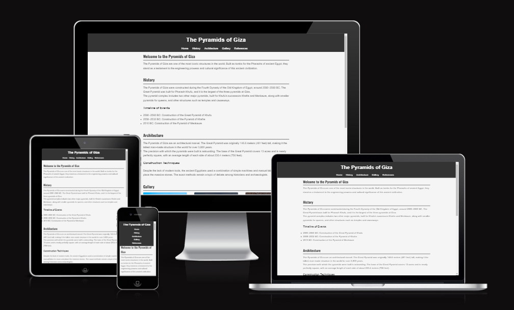
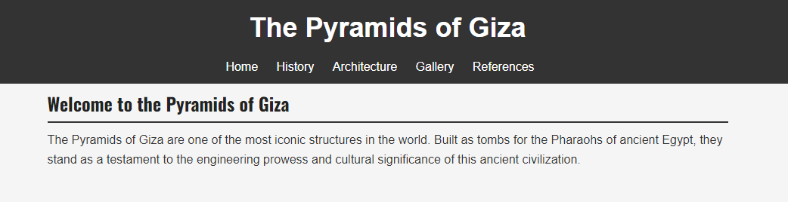
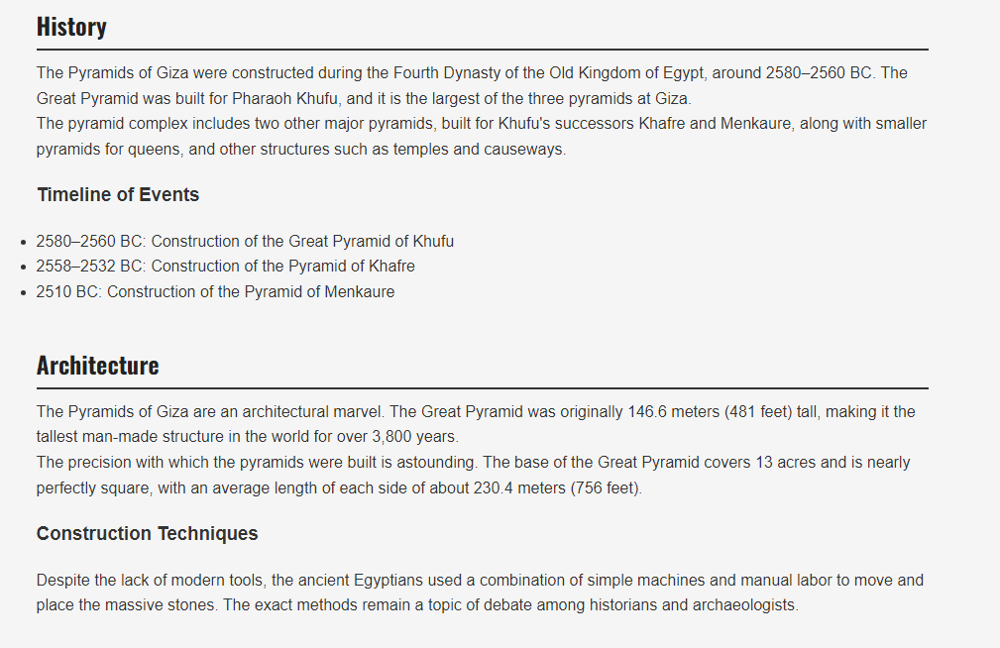
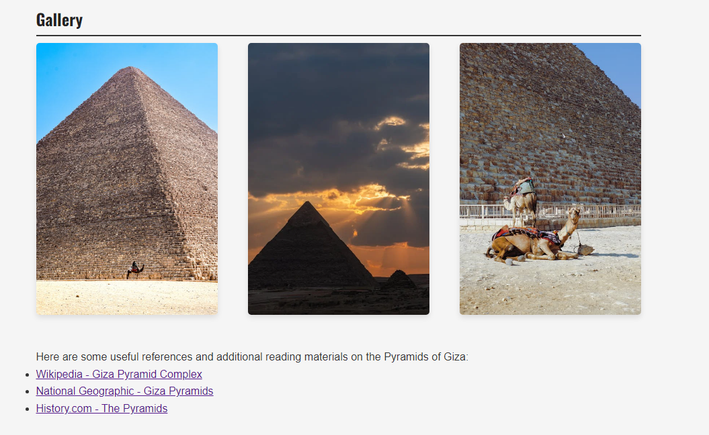
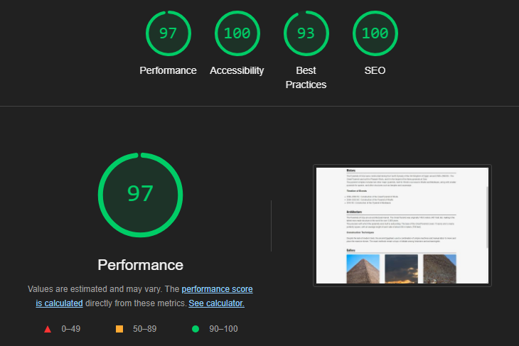

# Pyramids of Giza 

Welcome to the Pyramids of Giza web application. This project is a front-end web application that provides information about the Pyramids of Giza, one of the most iconic structures in the world. The site is designed to be accessible, responsive, and easy to navigate.

 

## Features
* Navigation
  * Responsive Design: The website is fully responsive, adapting its layout to different screen sizes, including mobile phones, tablets, and desktops. Media queries are used to ensure that the design remains user-friendly and visually appealing across all devices.

  * Accessibility: The site adheres to web accessibility standards. All images have descriptive alt text, and color contrasts are optimized to ensure readability for users with visual impairments.

  * Intuitive Navigation: The site features a main navigation menu that allows users to easily access different sections of the page. The navigation is designed to be clear and simple, enhancing the overall user experience.

  * Structured Layout: The content is organized into distinct sections (Home, History, Architecture, Gallery, and References), with headers and subheaders used to create a logical flow of information. This makes it easy for users to find and engage with the content.

  * Gallery: A dedicated gallery section displays high-quality images of the Pyramids of Giza. The images are styled consistently and are presented in a grid layout that adapts to different screen sizes, ensuring they look good on all devices.

 

* The header
  * Sticky Header: The header remains at the top of the page as users scroll, ensuring the navigation menu is easily accessible at all times. This enhances usability by keeping key navigation links within easy reach.

  * Navigation Menu: The header contains a navigation menu with links to the main sections of the website (Home, History, Architecture, Gallery, and References). The menu is straightforward and designed to provide a clear path through the site's content.

  * Responsive Design: The header is responsive, adapting to different screen sizes. On smaller screens, the layout of the header adjusts to ensure that the navigation menu remains easy to interact with.

  * Branding: The header includes the site’s title, "The Pyramids of Giza," prominently displayed to reinforce the site’s identity and purpose.

   

  * History and Architecture
    * Informative Content: The History section provides detailed information about the Pyramids of Giza, including their construction timeline and the pharaohs for whom they were built. This section is designed to educate users about the historical significance of the pyramids.

    * Clear Structure: The content is organized with headings and subheadings, making it easy for users to navigate and understand the information. The use of a timeline helps to break down the historical events into digestible parts.

    * Consistent Design: The styling of the History section is consistent with the rest of the site, using the same fonts and colors to ensure a cohesive user experience.

    * Detailed Description: The Architecture section discusses the architectural features of the Pyramids of Giza, including their dimensions, construction techniques, and the challenges faced by the ancient Egyptians. This section aims to highlight the engineering marvels of the pyramids.

    * Visual and Textual Balance: The section balances text with relevant subheadings, ensuring that the information is presented in a clear and engaging way. This layout makes it easier for users to find specific details about the architectural aspects of the pyramids.

    * Consistent Design: Like the History section, the Architecture section follows the site's overall design language, maintaining visual consistency across the pages.

 

* Gallery and Refrences
  
  * Visual Showcase: The Gallery section features a collection of high-quality images that visually represent the Pyramids of Giza. The images are carefully selected to provide different perspectives of the pyramids, enhancing the user’s visual experience.

  * Responsive Image Layout: The images in the gallery are arranged in a flexible grid layout that adapts to different screen sizes. This ensures that the gallery looks appealing and is easy to navigate on both large and small devices.

  * Consistent Styling: The images are styled with rounded corners and subtle shadows, maintaining a consistent visual theme throughout the site. This attention to detail contributes to the overall aesthetic quality of the website.

  * Curated Resources: The References section provides a list of external links to reputable sources for users who want to learn more about the Pyramids of Giza. These references include well-known platforms like Wikipedia, National Geographic, and History.com.

  * External Links: All links in the References section are set to open in a new tab, ensuring that users can easily return to the main site without losing their place. This design choice enhances the user experience by making it simple to explore additional information.

  * Organized Layout: The references are listed in an organized manner, with each link clearly described to inform users about what they can expect from the source. This helps users quickly find the information they are interested in.

## Testing

* I tested that the webpage works in different browsers: Chrome, Firefox, safari.

* I confirmed that the webpage is responsive and functions on the diffrent screen sizes using devtools.

* I confrimed that the diffrent parts of the page are readable and functioning 

* I confrimed that the links open i a separate tabs

### Bugs 

   Solved bugs
* When I ran my code through the HTML validator, it indicated an issue where some image files had spaces in their names.

* I changed the file names, and the issue was resolved.

### Validator Testing

* HTML
  * No errors were returned when passing through the official W3C validator.
* CSS
  *  No errors were returned when passing through the official (jigsaw) validator.
* Accessibility
  * I confirmed that the colors and fonts chosen are easy to read and accessible by running it through lighthouse in devtools  

 

## Deployment

* The site was deployed to GitHub pages

## Credits
### Content
* The code for the metatags was taken from the love running project 

### Media
* The images were taken from Pexels